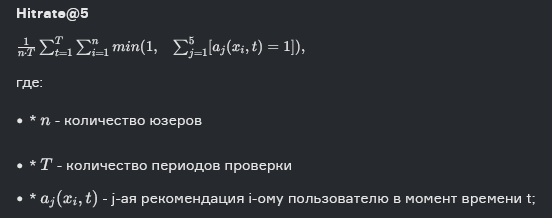

# Финальный проект КС
## Структура
1. app_fc_2:
   1. app_fc_2.py - итоговый сервис
   2. feature_uploader.py - скрипт для загрузки фичей в БД КС
   3. loader_for_step_5.py - скрипт-лоадер модели, для шага 5
2. notebooks_fc_2
   1. catboost_info - системная папка с информацией о последней выгруженной модели. 
   2. scratches - наброски по первой итерации решения
   3. catboost_model - первая сносно работающая модель
   4. catboost_model_modified - итоговая модель
   5. new_model_train - основной ноутбук с разработкой фичей и тренировкой модели
   6. data_preparator - ноутбук с работой по выделению фичей для БД КС, а также итоговыми тестами модели.
3. unit_tasks - первая часть финального проекта

## Задание
Необходимо разработать рекомендательную систему, возвращающую топ 5 постов, которые бы понравились пользователю.

### Особенности шага 2

<h3>Описание данных</h3>
<h5>Таблица user_data</h5>
Cодержит информацию о всех пользователях соц.сети
<table>
<tbody><tr><td>Field name</td><td>Overview</td></tr>
<tr><td><b>age</b></td><td>Возраст пользователя (в профиле)</td></tr>
<tr><td><b>city</b></td><td>Город пользователя (в профиле)</td></tr>
<tr><td><b>country</b></td><td>Страна пользователя (в профиле)</td></tr>
<tr><td><b>exp_group</b></td><td>Экспериментальная группа: некоторая зашифрованная категория</td></tr>
<tr><td><b>gender</b></td><td>Пол пользователя</td></tr>
<tr><td><b>user_id</b></td><td>Уникальный идентификатор пользователя</td></tr>
<tr><td><b>os</b></td><td>Операционная система устройства, с которого происходит пользование соц.сетью</td></tr>
<tr><td><b>source</b></td><td>Пришел ли пользователь в приложение с органического трафика или с рекламы</td></tr>
</tbody>
</table>
<h5>Таблица post_text_df</h5>
Содержит информацию о постах и уникальный ID каждой единицы с соответствующим ей текстом и топиком

<table>
<tbody><tr><td><b>Field name</b></td><td><b>Overview</b></td></tr>
<tr><td><b>id</b></td><td>Уникальный идентификатор поста</td></tr>
<tr><td><b>text</b></td><td>Текстовое содержание поста</td></tr>
<tr><td><b>topic</b></td><td>Основная тематика</td></tr>
</tbody>
</table>
<h5>Таблица feed_data</h5>

Содержит историю о просмотренных постах для каждого юзера в изучаемый период.

<table>
<tbody>
<tr><td><b>Field name</b></td><td><b>Overview</b></td></tr>
<tr><td><b>timestamp</b></td><td>Время, когда был произведен просмотр</td></tr>
<tr><td><b>user_id</b></td><td>id пользователя, который совершил просмотр</td></tr>
<tr><td><b>post_id</b></td><td>id просмотренного поста</td></tr>
<tr><td><b>action</b></td><td>Тип действия: просмотр или лайк</td></tr>
<tr><td><b>target</b></td><td>1 у просмотров, если почти сразу после просмотра был совершен лайк, иначе 0. У действий like пропущенное значение.</td></tr>
</tbody>
</table>

### Метрика

### Ограничения

1. На практике мы хотим достаточно быстро формировать рекомендации. Поэтому будем требовать, чтобы алгоритм работал не более, чем ~0.5 секунд на 1 запрос, и занимал не более ~4 гб памяти (цифры приблизительные).
2. Набор юзеров фиксирован и никаких новых появляться не будет
3. Чекер будет проверять модель в рамках того же временного периода, что вы видите в БД
4. Модели не обучаются заново при использовании сервисов. Мы ожидаем, что ваш код будет импортировать уже обученную модель и применять ее.

## Общая идея решения
### Выбор подхода
Перед нами одна из классических, но менее распространённых задач про рекомендательную систему. Самые лучшие результаты для решения этой задачи показывают гибридные методы фильтрации. Например, в этом [соревновании](https://www.kaggle.com/code/gspmoreira/recommender-systems-in-python-101#Recommender-Systems-in-Python-101) очень подробно разобраны различные методы фильтрации признаков.

Я выбрал контентный подход как наиболее разнообразный с точки зрения изученных на курсе методов. Основная идея состоит в следующем: нужно собрать максимально полный датасет, который будет каким-то образом преобразолван, далее скормлен мощному алгоритму, например, бустингу, и на основе предсказаний модели мы сможем получать вероятностные оценки по всем постам из имеющегося обогащённого датасета.

Стоит заметить следующие особенности подхода:
1. Получающееся качество в высшей степени чувствительно к признакам датасета. Это означает, что необходимо заранее сгенерировать все новые признаки на всём рабочем датасете, что может быть затруднительно.
2. Рекомендательная система безотносительно выбранной модели тем точнее, чем на большем количестве данных её обучать.  

### Выбор фичей
В силу чувствительности подхода к формированию признаков датасета, основной упор при обучении модели был на их выделении и создании.
Базовые признаки user_id по результатам EDA оказались плохо распределены, а в разрезе по действиям "просмотр/лайк" практически полностью идентичны. Это очень сильно сократило привлекательность таблицы user_data.
Тем не менее, первое обучение модели было произведено на базовых признаках с небольшим изменением - переформированием таргета. Идя была в том, что колонка "target" на самом деле не отображает желаемого результата и нам нужно предсказывать лайки в принципе, а не лайки после просмотра. Идея оказалась неверной.
Также очевидной идеей является OHE-MTE категориальных фич и агрегация над TF-IDF текста поста. Однако, для полноценного прогона TF-IDF банально не хватило мощности.
Первый прогон обучения производился на 1млн записей feed_data и показал результаты ниже требуемых в задании (hitrate@5 порядка 0.4). Эта неудача навела на мысль, что следует поискать типовые решения для контентного подхода.

Удачной оказалась идея с подсчётом слов в тексте (простая замена TF-IDF) - предположение, что человеку проще и приятнее воспринимать короткую информацию кажется разумным (X, новостные ленты соц.сетей, Telegram). Далее я воспользовался ещё одной подсказкой - а что если посмотреть, сколько лайков каждый пользователь ставит по каждому топику? Это позволит собрать предпочтения каждого конкретного юзера.
Наконец, последняя подсказка указывает, что полезно подсчитать популярность постов как таковых - их количественные статистики просмотров и лайков, а также процент лайков относительно лайков всех остальных постов. Таким образом мы знаем, какие топики постов больше нравятся тому или иному пользователю, и насколько популярен пост, который пользователь просмотрел.
Временную метку решено было оставить, т.к. существует логика в том, что пользователям больше нравятся более актуальный контент.

Сами преобразования и результат важности получившихся фич см. в new_model_train.ipynb

### Выбор модели
Первая попытка обучения была произведена через pipe с линейной классификацией, скейлером и автоматическими OHE-MTE энкодерами. После неудачи с метрикой и сомнений по поводу верно выбранных фичей, было принято решение также сменить модель в целях исключительно разнообразия (и немного из-за патриотических чувств). Последующие тесты показали, что необходимости менять модель на какую-то другую нет.
В решении использовался catboost с 1000 итераций, оценкой PRAUC (т.к. по сути у нас решение задачи классификации - лайкнет или нет), ограниченным verbose (для компактности) и установленным random_seed - чтобы быть уверенным, что очередная попытка обучения показывает воспроизводимые лучшие результаты.

### Выделение фич для работы модели
Т.к. в рамках задания создание новых фич выбранного подхода не представлялось возможным из-за дискового пространства и ограничений по памяти, было принято решение произвести "трюк", который позволил бы модели выдать предикт для любого юзера.
Для начала, объём таблиц:
1. user_data ~163k
2. post_text_df ~7k
3. feed_data ~77kk

Очевидно, что склеенный датасет такого размера нереально и бессмысленно загружать на сервера KC, т.к. даже в случае успеха выкачать в память приложения такой датасет не представляется возможным из-за ограничений задания. Тем не менее, для этого датасета локально были созданы все те же фичи, что и для обучающей выборки, и далее произведено сокращение до 3% данных с условием, что в результирующей выборке будут все уникальные user_id оригинального датасета, т.е. все вообще уникальные user_id.
Таким образом мы имитируем оригинальный датасет в подходящем для задании качестве. 

Этот процесс описан в файле data_preparator.ipynb. 

__Осторожно!__ Запуск этого ноутбука в случае, если Вы также имеете под рукой всю таблицу feed_data потребует внушительного количества памяти локальной машины.

### Направления для развития

1. В реализации решения присутствовал баг - забыл фильтровать лайки перед предсказаниями по юзеру. Баг исправлен, качество модели 0.561 против 0.573 с багом. Ожидаемо, но приемлемо. 
2. Хорошей практикой может быть отсеивание юзеров, мало взаимодействующих с контентом. В это м же [соревновании](https://www.kaggle.com/code/gspmoreira/recommender-systems-in-python-101#Recommender-Systems-in-Python-101) она была внедрена, но в рамках данного задания мной не имплементирована. Оценить влияние практики на качество (To_Do).
3. Возможно лучшим решением задачи будет применение коллаборативной или гибридной фильтрации. Несмотря на то, что в задании требуется загружаемая модель с методами predict и predict_proba, реально существуют библиотеки, в которых реализованы модели фильтрации с такими методами - surprise, Crab
   1. Попытка решение на 3%-м семпле датасета с использованием только коллаборативной фильтрации дала результат 0.110, что было ожидаемо, учитывая что количество взаимодействий пользователя с контентом в таком датасете было минимальным (около 6). Более того, разработанное решение не применимо на ограничение задачи, т.к. работа с таблицой с весами каждый пост-каждый юзер выходит за ограничения по памяти. Есть две идеи по дальнейшему развитию:
      1. Увеличить процент семпла с 3х до 10ти. Это всё ещё не позволит применить результат в задаче, однако должно серьёзно улучшить метрику (вплоть до 0.3, учитывая попытку номер 0 на выборке feed_data 1млн без охвата всех юзеров).
      2. Попробовать гибридный подход к фильтрации (To_Do).
4. Пообщавшись с другими студентами с курса выяснилось, что TF-IDF с разного рода агрегациями и кластеризация топиков дают хорошие результаты.
   1. Голый TF-IDF, label_encoder для топиков и PCA на все удалённые в первом решении колонки юзера дали расчётный hitrate@5 0.54, при этом расчёт на задании выдал неудовлетворительные 0.499. Наличие PCA на метрику значимо не влияют.
   2. TF-IDF + кластеризация топиков. Методом Kmeans на 6 кластеров расчётную метрику улучшает до 0.54, метрику в задании - 0.504. При этом топик и kmeans начинают коррелировать порядка 0.64. Тем не менее, наличие топика оказывается сильнее, чем его отсутствие - 0.54 против 0.53 расчётная. Изменение агрегации TF-IDF c mean на sum значимо на метрику не влияет.
   3. Тюнинг модели и увеличение кластеров до 10 в различных комбинациях со входными параметрами показывали значимое приращение метрики задания - до 0.516.
   4. Последняя попытка имплементации голого mean TF-IDF + 10 кластеров без какой-либо обработки данных на 10% сэмпле дала расчётную метрику 0.614 и метрику задания 0.572. Такая высокая метрика на трэине обуславливается наличием в расчёте колонки action, значимость которой превышает 90%.
   5. Параметры затюненой модели:
      1. Метрика - PRAUC.
      2. learningRate - 0.1 (перебирались 0.03, 0.1, 0.2, 0.4)
      3. depth - 10 (перебирались 4, 6, 10)
      4. iterations - 500 (перебирались 400, 500, 1000, исключительно ради скорости работы на CPU)
      5. Устройство расчёта - CPU, т.к. на GPU не имплементирована PRAUC и считается Logloss
      6. Количество потоков - 8, зависит от локальной машины.
      7. Все категориальные колонки были обработаны OHE, MTE и скейлером.
      8. От l2 регуляризации отказался для скорости расчёта.
5. Потенциально хорошим результатом видится совмещение сильных признаков из раздела "Выбор фичей" и TF-IDF с KMeans
   1. При абсолютно топовых метриках при расчёте (0.6365 на 10%, 0.5986 на 3%) модель даёт в целом скудные результаты на тесте в задании (0.558), тем не менее, целевой результат всё равно бьётся.
6. Дождаться разбора решения от преподавателя курса (to_do).